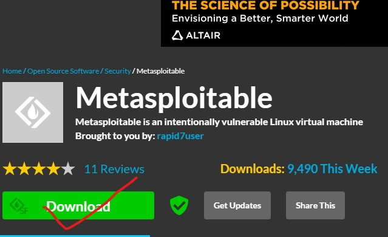
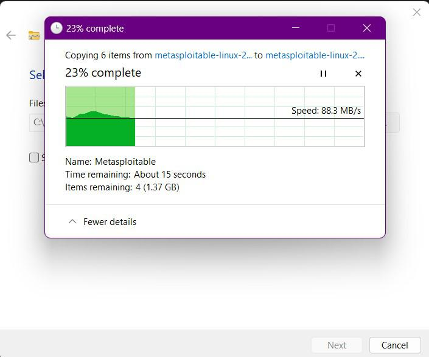
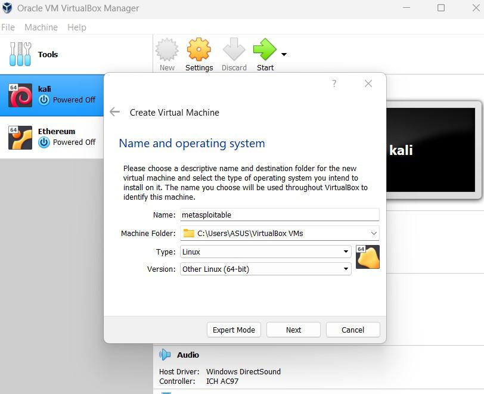

<h2>Metasploitable-Machine</h2>
  
  
<h2>Process on how i install Metasploitable home lab</h2>

Metasploitable is a deliberately vulnerable virtual machine (VM) designed for testing security tools, learning ethical hacking, and practicing penetration testing. Created by Rapid7, it mimics real-world security vulnerabilities in a controlled, secure environment. Running primarily on Linux, Metasploitable features outdated software, misconfigured services, and exploitable security flaws, making it a valuable resource for security research. It is commonly used in conjunction with the Metasploit framework to identify and exploit these vulnerabilities. Users can experiment with various attack methods, such as gaining unauthorized access, exploiting remote services, and testing web application weaknesses. However, it’s crucial to remember that Metasploitable is intended for educational purposes only and should always be used in isolated environments to avoid potential risks to other networks."

<h2>Process 1</h2>

Download Metasploitable from reliable sources, such as Rapid7's official website, and select the appropriate version. Ensure you have a stable internet connection, and verify the download to prevent corrupted files, ensuring secure usage.

<h2>Process 2</h2>
.

After downloading Metasploitable, the next step is to extract the compressed file using tools like WinRAR or 7-Zip. Save the extracted folder to your desired location. This folder contains the necessary virtual machine files for setup. Make sure the extraction process completes without issues, as these files will be imported into a virtualization platform such as VMware or VirtualBox.

<h2>Process 3</h2>
.

Click on the "New" option in VirtualBox to create a new virtual machine and begin the setup process.

A window will pop up, asking you to enter the details for your virtual machine. Enter the following information:

Name: Choose a name of your preference.

Path: Keep the default recommended path.

Version: Select "Other (64-bit)."

Fill in these details to proceed with setting up your virtual machine.

<h2>Process 4</h2>
.

Choose the amount of RAM to allocate to the virtual machine. It’s recommended to assign 512MB for optimal performance.

<h2>Process 5</h2>
.

Select the option to use an existing virtual hard disk file. This allows you to connect a pre-configured virtual drive.

<h2>Process 6</h2>
.

Carefully configure the network settings for your virtual machine to ensure security. It’s strongly recommended to use either NAT or Host-only network options. These configurations help keep the virtual machine isolated from public networks, minimizing the risk of exposure to external threats. This is particularly crucial for Metasploitable, as it is deliberately vulnerable and should never be connected to untrusted networks. Proper network setup creates a safe environment for testing and learning, reducing the risk of unintended network access or compromising your system's security. Always double-check your settings to maintain isolation and safeguard your virtual lab.

Now locate the file that we have extracted.

Now save the file and you will see that the instance is created with the name you have given.

You’re all set! Simply click the "Start" button at the top to initiate the machine. Wait as it boots up and loads the instance, preparing your virtual environment for use.

<h2>Process 7</h2>
.

After the instance has finished loading, you’ll be prompted to enter a login name and password. The default credentials are as follows:

Login Name: msfadmin

Password: msfadmin

When you finished logging in with the provided credentials, then you’ll gain access to the machine, completing the installation process successfully.
